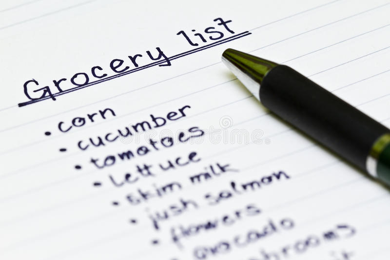
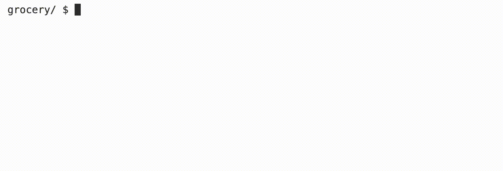

# Grocery List

## Learning Goals
 * Practice using a python dictionary
 * Learn to use try/except statements



## Background
Suppose that you’re in the habit of making a list of items you need from the grocery store. You might enter the same item more than once, and your list might have no particular order. Wouldn't it be nice to have items totalled up and sorted so you can be organized before you get to the store?

+ Hints
  * Odds are you’ll want to store your grocery list as a `dict`.
  * Note that a `dict` comes with quite a few methods, per [docs.python.org/3/library/stdtypes.html#mapping-types-dict](https://docs.python.org/3/library/stdtypes.html#mapping-types-dict), among them get, and supports operations like:

    ```python
    d[key]
    ```

    and

    ```python
    if key in d:
        ...
    ```

    wherein d is a `dict` and `key` is a `str`.

## Demo


## Getting Started

1. Log into [code.cs50.io](https://code.cs50.io/) using your GitHub account. 
2. Click inside the terminal window and execute `cd`.
3. At the `$` prompt, type `mkdir grocery`
4. Now execute `cd grocery`
5. Now type `code grocery.py` to make a file called `grocery.py`, where you'll write your program. (No distribution code for this problem!)

## Implementation Details
In a file called `grocery.py`, implement a program that prompts the user for items, one per line, until the user inputs control-d (which is a common way of ending one’s input to a program). Then output the user’s grocery list in all uppercase, sorted alphabetically by item, prefixing each line with the number of times the user inputted that item. No need to pluralize the items. Treat the user’s input case-insensitively.

In part because control-d ends the program abruptly, Python treats its entry as a particular type of error, called an `EOFError`. Because we'll use this `EOFError` to end our program, we want our handling of this error to be as graceful as possible. One of the "pythonic" ways to handle errors is to use `try` and `except`. Rather than testing for a particular valid condition, you can use a `try` block to do an operation and—if that operation raises a particular error-write code to handle that error inside of an except block.

You can, for instance, detect when the user has inputted control-d by "catching" an EOFError with code like:

```python
try:
    item = input()
except EOFError:
  ...
```

Learn more about Python exceptions in [CS50’s Introduction to Programming with Python](https://cs50.harvard.edu/python/2022/weeks/3/).

## Thought Question
 * What other applications can you think of where a python dictionary could be useful?

## How to Test Your Code

Your program should behave per the examples below.

```
grocery/ $ python grocery.py
banana
apple
banana
apple
tortilla
cookies
ice cream

2 APPLE
2 BANANA
1 COOKIES
1 ICE CREAM
1 TORTILLA
```

You can check your code using `check50`, a program that CS50 will use to test your code when you submit, by typing in the following at the `$` prompt. But be sure to test it yourself as well!

```
check50 cs50/problems/2022/python/grocery
```

## How to Submit

In your terminal, execute the below to submit your work.

```
submit50 cs50/problems/2022/python/grocery
```
