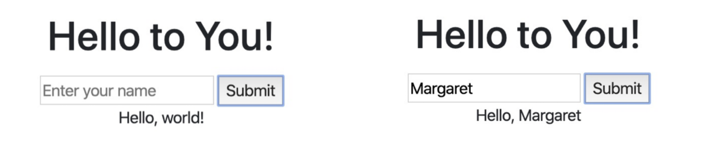

# Hello to JavaScript

## tl;dr
Learn to use JavaScript to get input from a form and use it to modify HTML in your CS50 [codespace](https://code.cs50.io).
<!-- Build a simple website of your **Write My New York** using HTML and CSS in your [codespace](https://code.cs50.io). -->

## Background
JavaScript is often called the "language of the web." It can read input from your webpage and update both HTML and CSS. In this program you will complete the JavaScript portion of distribution code in order to read a name from a text box and use it to update the HTML.

<!-- ## Getting Ready

<style type="text/css">
.iframe_container {
	position: relative;
	padding-bottom: 56.25%; 
	padding-top: 25px;
	height: 0;
	margin-bottom: 30px;
}

.iframe_container iframe {
	position: absolute;
	top: 0;
	left: 0;
	width: 100%;
	height: 100%;
}
</style>

First watch this video with Brian Yu on using `HTML` in the CS50 IDE:

<div class="iframe_container">
  <iframe src="https://www.youtube.com/embed/78wdlyzrKOA?modestbranding=1&amp;rel=0&amp;showinfo=0" frameborder="0" allow="accelerometer; autoplay; encrypted-media; gyroscope; picture-in-picture" allowfullscreen=""> </iframe>
</div>


 -->

## Getting Started
Here’s how to download this problem’s "distribution code" (i.e., starter code) into your codespace. Log into [code.cs50.io](https://code.cs50.io) and then, in a terminal window, execute each of the below.

1. Execute `cd` to ensure that you’re in` ~/` (i.e., your home directory, aka ~).
2. Execute `mkdir hellojavascript` to create a new directory.
3. Execute `cd hellojavascript` to move into that directory.
4. Execute `wget https://raw.githubusercontent.com/cs50nestm/web/master/distro/hello.html` to download an html file with this problem’s distribution.
9. Execute `ls`. You should see this problem’s distribution code, `hello.html`.
10. You can immediately start a server to view the site by typing

```
http-server
```

in the terminal window and clicking on the link that appears.

## Specification

In the file `hello.html`, complete the JavaScript to output:

“Hello, world!” when nothing is input into the text box, and “Hello, Margaret” when I entered my name, Margaret as below.



## If You Don't Know How To Start

Watch the JavaScript chapter in the CS50 Lecture Video.

<style type="text/css">
.iframe_container {
	position: relative;
	padding-bottom: 56.25%; 
	padding-top: 25px;
	height: 0;
	margin-bottom: 30px;
}

.iframe_container iframe {
	position: absolute;
	top: 0;
	left: 0;
	width: 100%;
	height: 100%;
}
</style>

<div class="iframe_container">
  <iframe src="https://www.youtube.com/embed/5g0x2xv3aHU?start=6755;modestbranding=1&amp;rel=0&amp;showinfo=0" frameborder="0" allow="accelerometer; autoplay; encrypted-media; gyroscope; picture-in-picture" allowfullscreen=""> </iframe>
</div>

Watch the CS50 Short on JavaScript:

<div class="iframe_container">
  <iframe src="https://www.youtube.com/embed/Z93IaNfavZw?modestbranding=1&amp;rel=0&amp;showinfo=0" frameborder="0" allow="accelerometer; autoplay; encrypted-media; gyroscope; picture-in-picture" allowfullscreen=""> </iframe>
</div>

Finally, keep an eye out for a walk through of the solution for this problem that I will post in the next few days. But be sure to try it yourself first!

## How to Submit

submit50 cs50nestm/checks/2022/hellojavascript

Your submission should be graded for completion only within 2 minutes, at which point your score will appear at submit.cs50.io!
