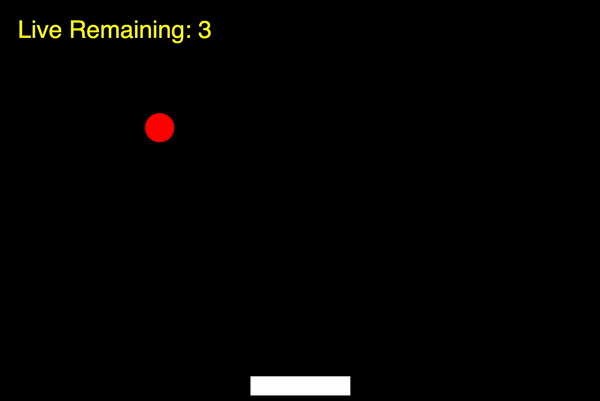

# Paddle Ball Game

The goal of this project is to complete the code we began to develop together duirng the recorded class on Wednesday, April 8th, to create a paddle and ball game.

Using p5.js, we created a paddle that moves left and right, and a ball that bounces off the paddle and off the left and right sides of the canvas. Using this starter code, your job is to complete one more more features, to be able to play this as a game.

## Getting Started

1. Execute `cd` to ensure that you’re in ~/ (i.e., your home directory, aka ~).
2. Execute `wget https://intro.cs50nestm.net/wp-content/uploads/2020/04/paddle.zip` to download a (compressed) ZIP file with this problem’s distribution.
1. Execute `unzip paddle.zip` to uncompress that file.
1. Execute `rm paddle.zip` followed by yes or y to delete that ZIP file.
1. Execute ls. You should see a directory called `paddle`, which was inside of that ZIP file.
1. Execute `cd paddle` to change into that directory.
1. Execute ls. You should see this problem’s distribution code, including index.html, style.css and sketch.js

## Next Step

If you did not join us for the live 4/8 class or watch the video posted on Classroom, please watch the video here and code along with me to create your starter code.

  <iframe src="https://www.youtube.com/embed/B3VLmTtAxUk" frameborder="0" allow="accelerometer; autoplay; encrypted-media; gyroscope; picture-in-picture" allowfullscreen></iframe>

## Specification

1. Using this starter code, add one more feature, such as having the ball bounce off the top of the canvas.
2. Create a variable to keep track of the number of lives, and use the p5 `text()` function to write the number of lives to the screen.
3. Decrease the number of lives each time the paddle misses the ball.
4. Reposition the ball to the top of the screen using the `mouseClicked()` function to have the ball start falling again.
5. When the number of lives goes to zero, display "Game Over".

