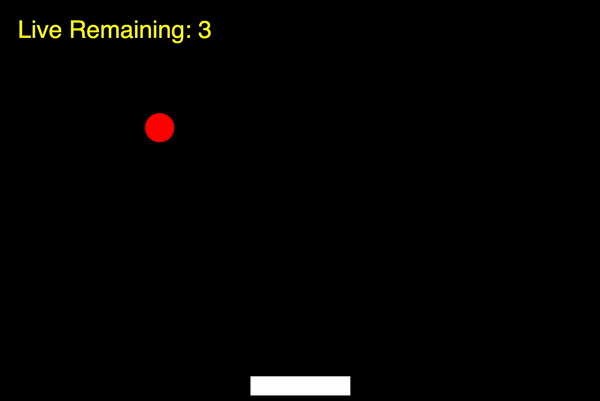

# Paddle Ball Game

The goal of this project is to create a game / animation that looks like the animation below:

You will be working in p5.js. You will need a circle or ellipse and a rectangle. The circle will move in a similar way as the DVD logo in your last project, and the rectangle (paddle) will be controlled by the left and right arrow keys.

## Getting Started

1. Execute `cd` to ensure that you’re in ~/ (i.e., your home directory, aka ~).
2. Execute `wget https://intro.cs50nestm.net/wp-content/uploads/2020/04/paddle.zip` to download a (compressed) ZIP file with this problem’s distribution.
1. Execute `unzip paddle.zip` to uncompress that file.
1. Execute `rm paddle.zip` followed by yes or y to delete that ZIP file.
1. Execute ls. You should see a directory called `paddle`, which was inside of that ZIP file.
1. Execute `cd paddle` to change into that directory.
1. Execute ls. You should see this problem’s distribution code, including index.html, style.css and sketch.js

## Specification

1. Using this starter code, start by creating a circle and a rectangle. 
2. Make the circle bounce off of the left and right ides and the top of the canvas.
3. Make the rectangle move left and right using the left and right arrow keys.
4. Create an algorithm to make the ball bounce off the paddle.
5. Create a variable to keep track of the number of lives, and use the p5 `text()` function to write the number of lives to the screen.
6. Decrease the number of lives each time the paddle misses the ball.
7. Reposition the ball to the top of the screen using the `mouseClicked()` function to restart the ball dropping.
8. When the number of lives goes to zero, display "Game Over".

## How to Submit

submit50 cs50nestm/checks/2020/paddle_ball

