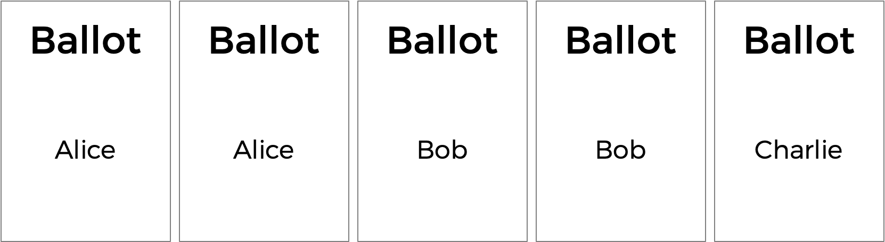

# Runoff

Implement a program that runs a runoff election, per the below.

```
./runoff Alice Bob Charlie
Number of voters: 5
Rank 1: Alice
Rank 2: Bob
Rank 3: Charlie

Rank 1: Alice
Rank 2: Charlie
Rank 3: Bob

Rank 1: Bob
Rank 2: Charlie
Rank 3: Alice

Rank 1: Bob
Rank 2: Alice
Rank 3: Charlie

Rank 1: Charlie
Rank 2: Alice
Rank 3: Bob

Alice
```

## Getting Started

Here's how to download this problem's "distribution code" (i.e., starter code) into your own CS50 IDE. Log into [CS50 IDE](https://ide.cs50.io/) and then, in a terminal window, execute each of the below.

* Execute `cd` to ensure that you're in `~/` (i.e., your home directory).
* Execute `cd pset3` to change into (i.e., open) your `pset3` directory that should already exist.
* Execute `wget TODO` to download a (compressed) ZIP file with this problem's distribution.
* Execute `unzip runoff.zip` to uncompress that file.
* Execute `rm runoff.zip` followed by `yes` or `y` to delete that ZIP file.
* Execute `ls`. You should see a directory called `runoff`, which was inside of that ZIP file.
* Execute `cd runoff` to change into that directory.
* Execute `ls`. You should see this problem's distribution code, in a file called `runoff.c`.

## Background

You already know about plurality elections, which follow a very simple algorithm for determining the winner of an election: every voter gets one vote, and the candidate with the most votes wins.

But the plurality vote does have some disadvantages. What happens, for instance, in an election with three candidates, and the ballots below are cast?



A plurality vote would here declare a tie between Alice and Bob, since each has two votes. But is that the right outcome?

There's another kind of voting system known as a ranked-choice voting system. In a ranked-choice system, voters can vote for more than one candidate. Instead of just voting for their top choice, they can rank the candidates in order of preference. The resulting ballots might therefore look like the below.


Here, each voter, in addition to specifying their first preference candidate, has also indicated their second and third choices. And now, what was previously a tied election could now have a winner. The race was originally tied between Alice and Bob, so Charlie was out of the running. But the voter who chose Charlie preferred Alice over Bob, so Alice could here be declared the winner.

Ranked choice voting can also solve yet another potential drawback of plurality voting. Take a look at the following ballots.


Who should win this election? In a plurality vote where each voter chooses their first preference only, Charlie wins this election with four votes compared to only three for Bob and two for Alice. But a majority of the voters (5 out of the 9) would be happier with either Alice or Bob instead of Charlie. By considering ranked preferences, a voting system may be able to choose a winner that better reflects the preferences of the voters.

One such ranked choice voting system is the instant runoff system. In an instant runoff election, voters can rank as many candidates as they wish. If any candidate has a majority (more than 50%) of the first preference votes, that candidate is declared the winner of the election.

If no candidate has more than 50% of the vote, then an "instant runoff" occurrs. The candidate who received the fewest number of votes is eliminated from the election, and anyone who originally chose that candidate as their first preference now has their second preference considered. Why do it this way? Effectively, this simulates what would have happened if the least popular candidate had not been in the election to begin with.

The process repeats: if no candidate has a majority of the votes, the last place candidate is eliminated, and anyone who voted for them will instead vote for their next preference (who hasn't themselves already been eliminated). Once a candidate has a majority, that candidate is declared the winner.

Let's consider the nine ballots above and examine how a runoff election would take place.

Alice has two votes, Bob has three votes, and Charlie has four votes. To win an election with nine people, a majority (five votes) is required. Since nobody has a majority, a runoff needs to be held. Alice has the fewest number of votes (with only two), so Alice is eliminated. The voters who originally voted for Alice listed Bob as second preference, so Bob gets the extra two vote. Bob now has five votes, and Charlie still has four votes. Bob now has a majority, and Bob is declared the winner.

What corner cases do we need to consider here?

One possibility is that there's a tie for who should get eliminated. We can handle that scenario by saying all candidates who are tied for last place will be eliminated. If every remaining candidate has the exact same number of votes, though, eliminating the tied last place candidates means eliminating everyone! So in that case, we'll have to be careful not to eliminate everyone, and just declare the election a tie between all remaining candidates.

Some instant runoff elections don't require voters to rank all of their preferences — so there might be five candidates in an election, but a voter might only choose two. For this problem's purposes, though, we'll ignore that particular corner case, and assume that all voters will rank all of the candidates in their preferred order.

Sounds a bit more complicated than a plurality vote, doesn't it? But it arguably has the benefit of being an election system where the winner of the election more accurately represents the preferences of the voters.

## Understanding

Let's open up `runoff.c` to take a look at what's already there. We're defining two constants: `MAX_CANDIDATES` for the maximum number of candidates in the election, and `MAX_VOTERS` for the maximum number of voters in the election.

Next up is a two-dimensional array `preferences`. The array `preferences[i]` will represent all of the preferences for voter number `i`, and the integer `preferences[i][j]` here will store the index of the candidate who is the `j`th preference for voter `i`.

Next up is a `struct` called `candidate`. Every `candidate` has a `string` field for their `name`, and `int` representing the number of `votes` they currently have, and a `bool` value called `eliminate` that indicates whether the candidate has been eliminated from the election. The array `candidates` will keep track of all of the candidates in the election.

The program also has two global variables: `voter_count` and `candidate_count`.

Now onto `main`. Notice that after determining the number of candidates and the number of voters, the main voting loop begins, giving every voter a chance to vote. As the voter enters their preferences, the `vote` function is called to keep track of all of the preferences. If at any point, the ballot is deemed to be invalid, the program exits.

Once all of the votes are in, another loop begins: this one's going to keep looping through the runoff process of checking for a winner and eliminating the last place candidate until there is a winner.

The first call here is to a function called `tabulate`, which should look at all of the voters' preferences and compute the current vote totals, by looking at each voter's top choice candidate who hasn't yet been eliminated. Next, the `print_winner` function should print out the winner if there is one; if there is, the program is over. But otherwise, the program needs to (via a call to `eliminate`) eliminate the last-place candidate (or candidates) from the election. If nobody is eliminated (because everyone left in the election is tied), then the election is declared a tie.

If you look a bit further down in the file, you'll see that these functions — `vote`, `tabulate`, `print_winner`, and `eliminate` — are all left to up to you to complete!

## Specification

Complete the implementation of `runoff.c` in such a way that it simulates a runoff election.

* Complete the `vote` function.
  * The function takes arguments `voter`, `rank`, and `name`. If `name` is a match for the name of a valid candidate, then you should update the global preferences array to indicate that the voter `voter` has that candidate as their `rank` preference (where `0` is the first preference, `1` is the second preference, etc.).
  * If the preference is successfully recorded, the function should return `true`; the function should return `false` otherwise (if, for instance, `name` is not the name of one of the candidates).
* Complete the `tabulate` function.
  * The function should update the number of `votes` each candidate has at this stage in the runoff.
  * Recall that at each stage in the runoff, every voter effectively votes for their top-preferred candidate who has not already been eliminated.
* Complete the `print_winner` function.
  * If any candidate has more than half of the vote, their name should be printed to `stdout` and the function should return `true`.
  * If nobody has won the election yet, the function should return `false`.
* Complete the `eliminate` function.
  * The function should eliminate the candidate (or candidates) who are still in the race and have the fewest number of votes.
  * If all remaining candidates are tied at the same number of votes, then the function should not eliminate anyone and return `false`.
  * Otherwise, the function should reset all candidates' vote counts back to `0` and return `true`.

## Walkthrough

TODO

## Usage

Your program should behave per the example below:

```
./runoff Alice Bob Charlie
Number of voters: 5
Rank 1: Alice
Rank 2: Charlie
Rank 3: Bob

Rank 1: Alice
Rank 2: Charlie
Rank 3: Bob

Rank 1: Bob
Rank 2: Charlie
Rank 3: Alice

Rank 1: Bob
Rank 2: Charlie
Rank 3: Alice

Rank 1: Charlie
Rank 2: Alice
Rank 3: Bob

Alice
```

## Testing

Be sure to test your code to make sure it handles...

* An election with any number of candidate (up to the `MAX` of `9`)
* Voting for a candidate by name
* Invalid votes for candidates who are not on the ballot
* Printing the winner of the election if there is only one
* Not eliminating anyone in the case of a tie between all remaining candidates

## How to Submit

TODO
