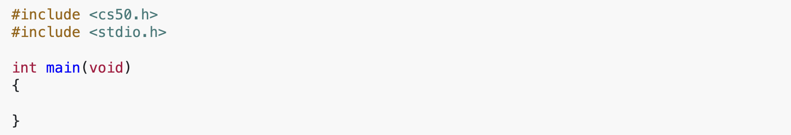
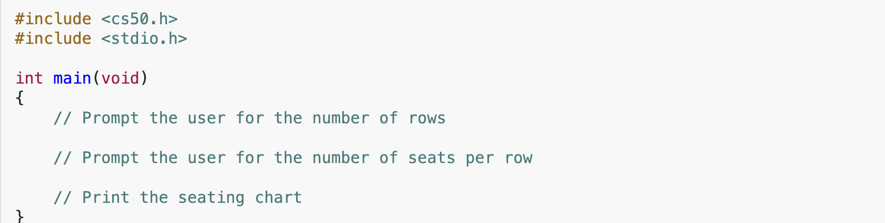

# Seats (Less)

## Problem to Solve

A certain nearby theater has *N* rows, with *M* seats in each row. Mavid Dalan, the theater manager, wants to print a seating chart showing the seat numbers for each row.

In a file called `seats.c`, in a folder called `seats-less`, write a C program to display the seating chart. The seats should be numbered consecutively starting from `1`.

For example, if the theater has 10 rows with 8 seats per row, your program might behave as follows:

```
Enter number of rows: 10
Enter number of seats per row: 8
 
Row  1:   1   2   3   4   5   6   7   8
Row  2:   9  10  11  12  13  14  15  16
Row  3:  17  18  19  20  21  22  23  24
Row  4:  25  26  27  28  29  30  31  32
Row  5:  33  34  35  36  37  38  39  40
Row  6:  41  42  43  44  45  46  47  48
Row  7:  49  50  51  52  53  54  55  56
Row  8:  57  58  59  60  61  62  63  64
Row  9:  65  66  67  68  69  70  71  72
Row 10:  73  74  75  76  77  78  79  80
```

## Requirements

- The program should prompt the user for the number of rows and number of seats per row.
- Print `Row X`, where X is the number row, then the numbered seats, starting from 1.

### Hints

- Recall that you can get an int from a user with get_int, which is declared in cs50.h.
- Recall that you can print formatted output, including numbers padded with spaces, using format specifiers like %4i in printf.

## Advice
<details>
  <summary>
    <span style="font-weight: bold;">
    Write some code that you know will compile
    </span>
  </summary>
  <br>
  <p>Even though this program won’t do anything, it should at least compile with make!</p>


  
</details>

<br>

<details>
  <summary>
    <span style="font-weight: bold;">
    Write some pseudocode before writing more code
    </span>
  </summary>
<br>
<p>Break the problem down into smaller pieces.</p>
<ol>
  <li>Prompt the user for the number of rows.</li>
  <li>Prompt the user for the number of seats per row./li>
  <li>Print a seating chart with that many rows and seats.</li>
</ol>
<p>So write some pseudcode as comments that remind you to do just that:</p>




</details>

<br>

<details>
  <summary>
    <span style="font-weight: bold;">
    Convert the pseudocode to code
    </span>
  </summary>
<br>
 
<p><code>get_int</code> from <code>cs50.h</code> will prompt the user and hand you back an int.</p>

<p>Once you have valid values for `rows` and `seats`, think about how to number seats consecutively across rows rather than computing each seat number from its row and column. What if you kept a separate counter that starts at `1` and increases by `1` every time you print a seat, regardless of which row you’re in?</p>

</details>

## How to Test

Does your code work as prescribed when you input:

- `1` row and 1 seat?
- A small number of rows and seats, like `3` and `5`?
- A large number of rows and seats, like `20` and `20`?
- Rows and seats that produce seat numbers with differing numbers of digits (e.g., single digits versus double or triple digits), to confirm your columns still line up?

### Correctness

```
check50 cs50/problems/2026/fall/seats/less
```

### Style

```
style50 seats.c
```

### How to Submit

In your terminal, execute the below to submit your work.

```
submit50 cs50/problems/2026/fall/seats/less
```

You may resubmit any problem as many times as you’d like before the deadline.

Your submission should be graded for correctness within 2 minutes, at which point your score will appear at [submit.cs50.io](https://submit.cs50.io)!
